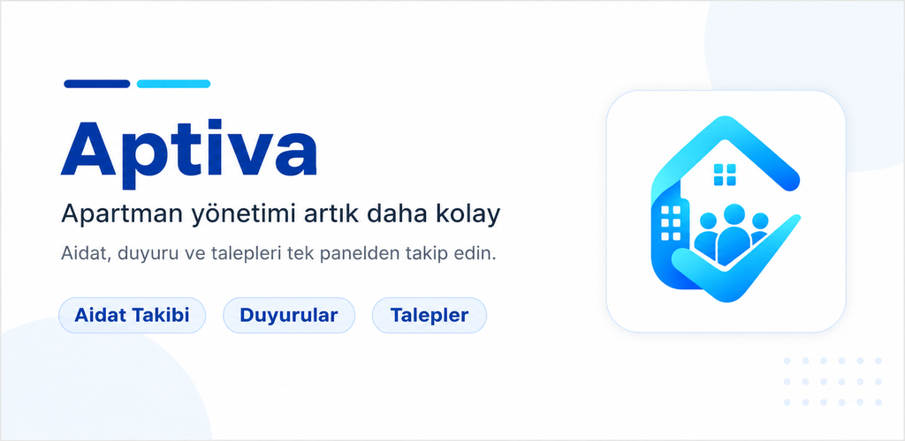
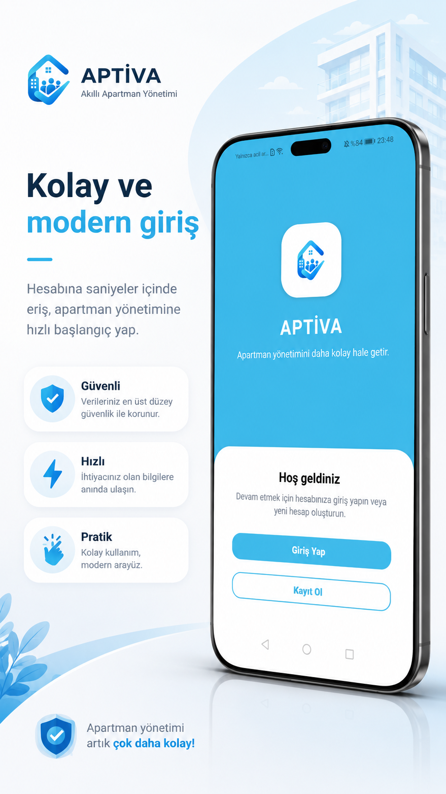
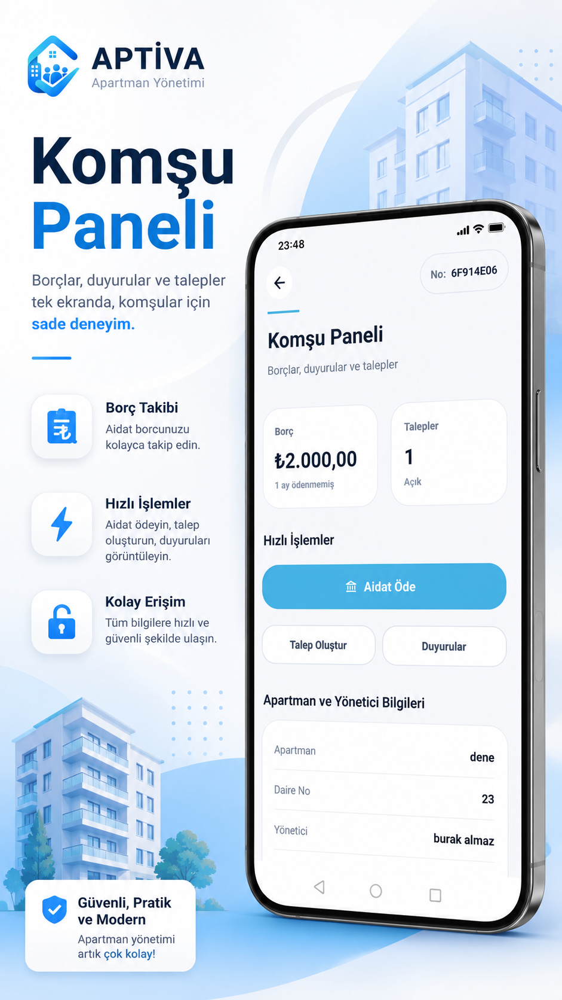
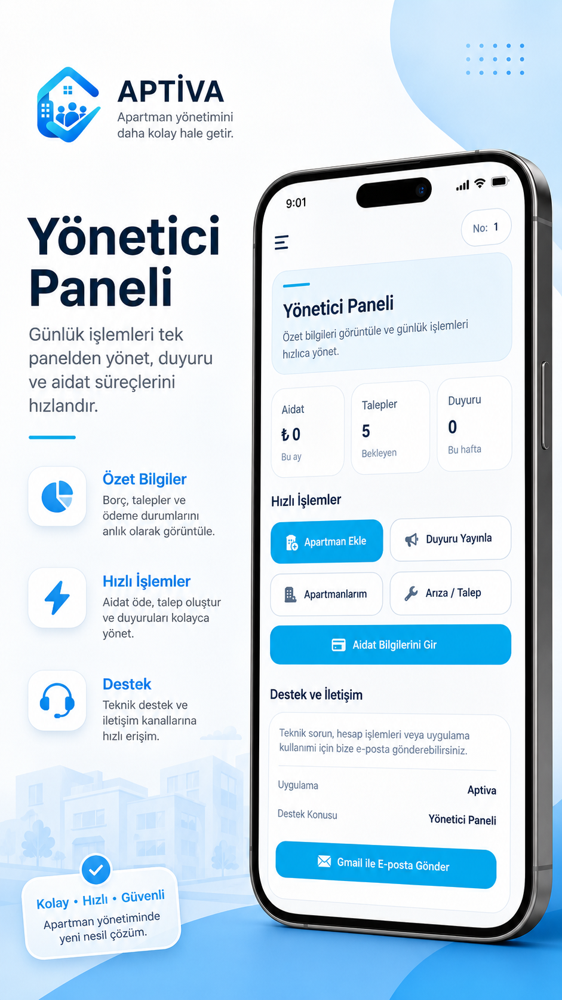
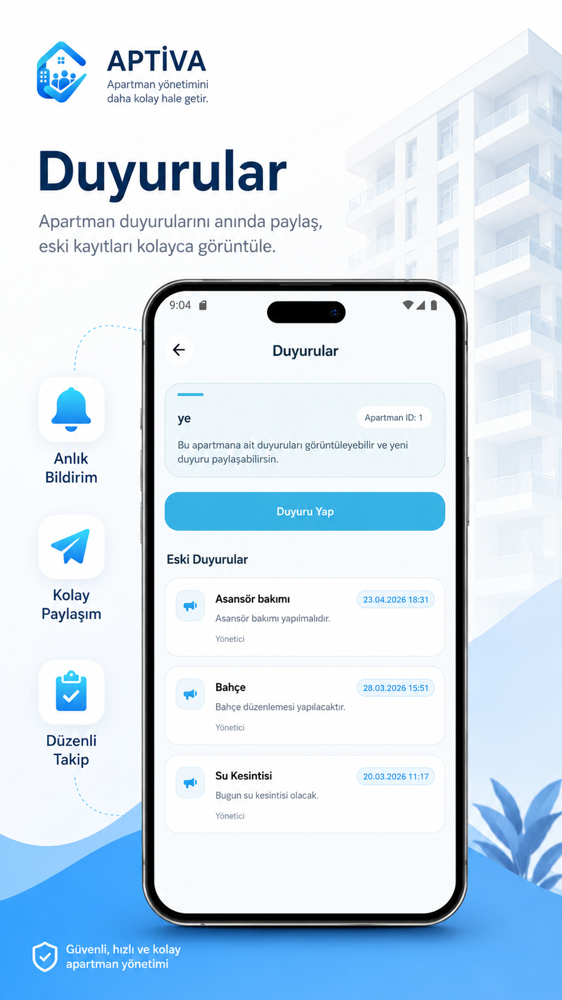
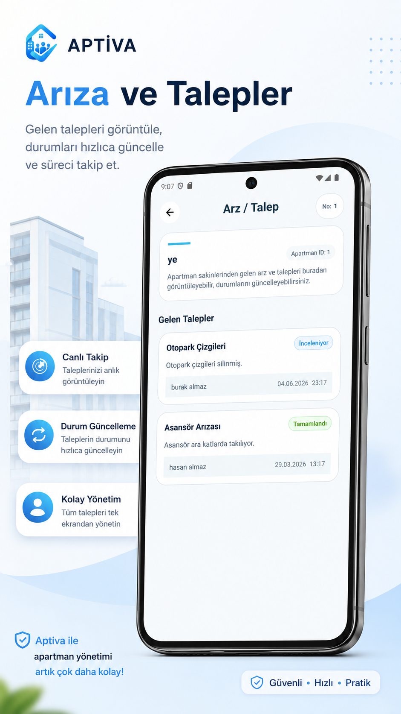
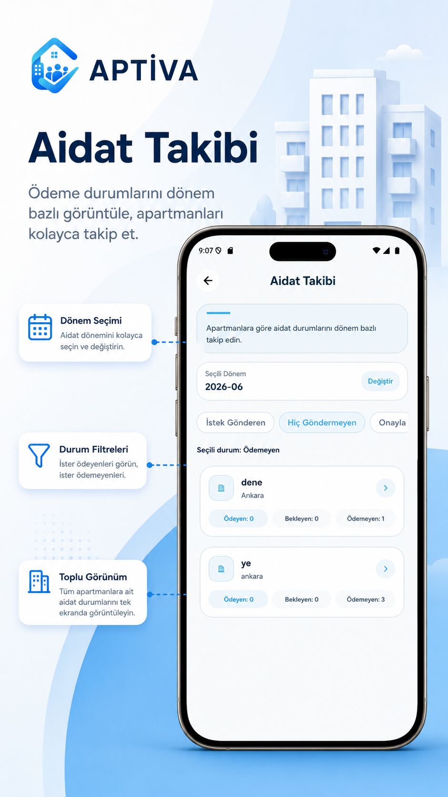
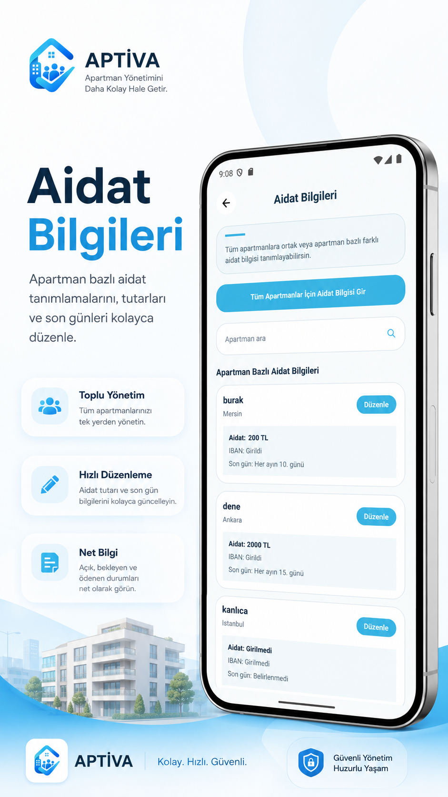
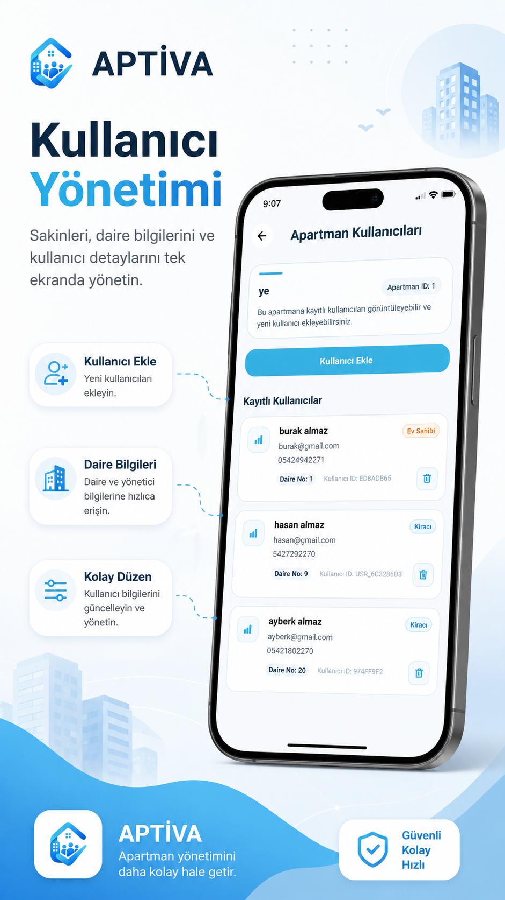
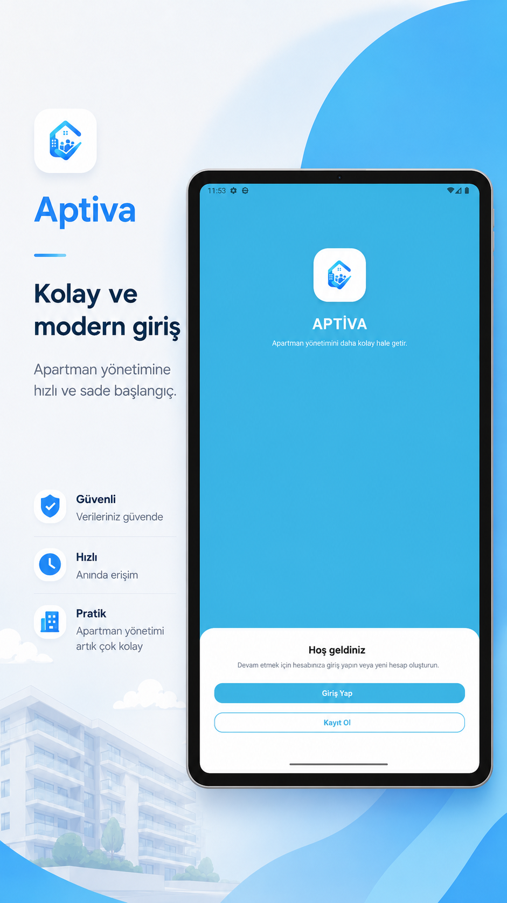

# 🏢 Apartment Management Showcase

**Apartment Management** is an Android application developed to digitalize residential building management processes for both managers and residents.

The project focuses on creating a practical, organized, and user-friendly mobile experience for managing apartment-related information, resident records, announcements, requests, and role-based user operations.

---

## Overview

Apartment Management is designed to simplify apartment and residential site management workflows in a mobile environment.

The application includes separate role-based flows for **managers** and **residents**. Managers can manage apartment and resident information, while residents can access their own apartment-related data through a clean and modern Android interface.

This repository is prepared as a **showcase repository** to present the project structure, technologies used, key features, and application screens.

---

## Tech Stack

- **Kotlin**
- **Android Jetpack Components**
- **Material Components**
- **RecyclerView**
- **ViewBinding**
- **Firebase Authentication**
- **Firebase Realtime Database**

---

## Key Features

- Secure user authentication
- Role-based user structure for managers and residents
- Apartment and resident information management
- User detail and profile display
- Announcement management
- Resident request tracking
- Organized and responsive Material UI
- Real-time data synchronization with Firebase
- Scalable project architecture for future improvements

---

## Highlights

- Real-world apartment management scenario
- Firebase-based authentication and database integration
- Clean and modern Android interface
- Structured user flows for different account types
- Manager and resident panels
- Real-time data updates
- Mobile-first user experience

---

## Screenshots

### Store Preview & App Introduction

  

### Authentication

  

### Resident Panel

  

### Manager Panel

  

### Announcements

  

### Requests

  

### Dues Tracking

  
  

### User Management

  

### Tablet Preview

  

---

## Project Purpose

The main purpose of this project is to create a digital apartment management experience where managers and residents can interact with apartment-related data in a simple and structured way.

The application was developed as a mobile solution for common apartment management needs such as user management, apartment information display, announcements, and request tracking.

---

## Role-Based Structure

### Manager

Managers can access management-focused screens and handle apartment-related operations.

Main manager-side features include:

- Viewing apartment information
- Managing resident records
- Accessing manager panel screens
- Monitoring resident-related data
- Managing announcements and requests

### Resident

Residents can access their own apartment-related information through a simplified interface.

Main resident-side features include:

- Viewing personal profile information
- Accessing apartment-related data
- Viewing announcements
- Tracking personal requests
- Using a clean and user-friendly resident panel

---

## Firebase Usage

This project uses Firebase services for authentication and real-time data management.

### Firebase Authentication

Firebase Authentication is used to manage secure user login and account access.

### Firebase Realtime Database

Firebase Realtime Database is used to store and synchronize application data in real time.

---

## UI Design

The application follows a clean and organized Material Design approach.

The interface focuses on:

- Simple navigation
- Readable layouts
- Card-based components
- Role-based screen organization
- Mobile-friendly user experience
- Consistent visual hierarchy

---

## Repository Note

This repository is prepared for project presentation and portfolio purposes.

The goal is to showcase the application's features, technologies, and interface design in a clear and professional way.

---

## Developer

Developed by **Burak Almaz**

- Android Developer
- Kotlin & Firebase
- Software Engineering Student
